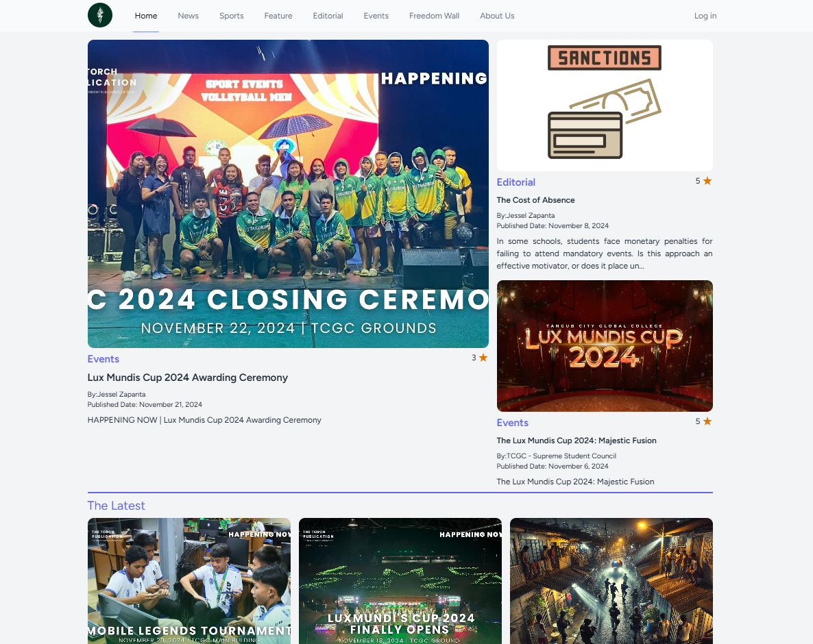

# The Torch Publication

A publication Website for the official publication office of Tangub City Global College.

## Application Requirements (Windows)
Ensure the following software is installed on your system:

- [Composer](https://getcomposer.org/)
- [Git](https://git-scm.com/)
- [XAMPP](https://www.apachefriends.org/download.html)
- [Node.js](https://nodejs.org/en)

## Technology Stack
- **Backend Framework**: Laravel 10
- **Frontend**: ReactJS
- **Database**: MariaDB

## Installation Guide

### Step 1: Clone the Repository
Ensure you have the necessary permissions to clone the repository. Run the following command:

```bash
https://github.com/JesselZapanta/thetorchpublication.git
```

### Step 2: Navigate to the Repository
Change your directory to the project folder:

```bash
cd tcepms
```

### Step 3: Install Dependencies

#### Composer Dependencies
Install the PHP dependencies:

```bash
composer install
```

#### Node Modules
Install the required Node.js packages:

```bash
npm install
```

### Step 4: Configure the Environment
Set up your `.env` file based on the `.env.example` provided. Ensure the database and application configurations are correct.

### Step 5: Run Database Migrations and Seeders
Execute the following command to set up the database schema and seed initial data:

```bash
php artisan migrate --seed
```

### Step 6: Create a Storage Link
Run the command below to create a symbolic link for storage:

```bash
php artisan storage:link
```

### Step 7: Generate Application Key
Generate the application encryption key:

```bash
php artisan key:generate
```

### Step 8: Start the Development Servers

#### Laravel Development Server
Run the Laravel backend:

```bash
php artisan serve
```

#### Vite Development Server
Open a new terminal and start the Vite server for the React frontend:

```bash
npm run dev
```

### Step 9: Access the Application
Visit the application in your web browser at [http://localhost:8000](http://localhost:8000).

<!-- Uncomment the following section once you have a project preview screenshot -->

Project Preview


